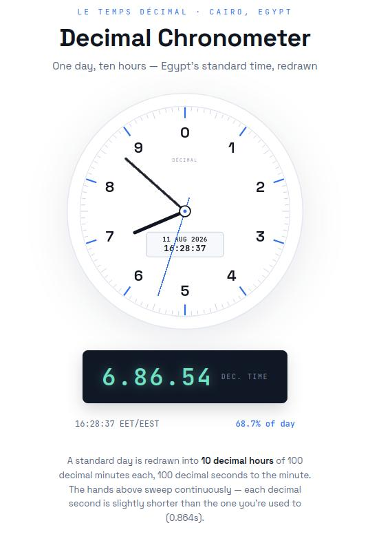

# Decimal Chronometer — 10-Hour Clock

> One day, ten hours — Egypt's standard time, redrawn.

<p align="center">
  
</p>

A single-file web application that renders the current time in **decimal (metric) time**:
a day divided into **10 decimal hours**, each of **100 decimal minutes**, each of
**100 decimal seconds**. The clock is fixed to **Cairo time** (`Africa/Cairo`),
displays the current standard time as a complication, and draws a continuously
sweeping analog dial of decimal hands.

## Features- 🕐 **Analog decimal dial** — 90 minor ticks + 10 major ticks (100 decimal-minute divisions), numerals 0–9, three continuously sweeping hands.
- 🖥️ **Digital decimal readout** — LCD-style panel showing `H.MM.SS` decimal time,
  updated every animation frame.
- 📅 **Complication window** — current Cairo date and standard time (`HH:MM:SS`)
  inside the dial, plus a standard-time meta row and day-progress percentage.
- ♿ **Accessible** — live-region readout (`role="timer"`, `aria-live="polite"`)
  and `prefers-reduced-motion` support.

## How decimal time works

A standard day (`86 400 000 ms`) is mapped onto a 100 000-second decimal day:

| Unit | Count per day | Length |
|------|--------------|--------|
| Decimal hour | 10 | 2 h 24 min |
| Decimal minute | 100 per hour | 1 min 26.4 s |
| Decimal second | 100 per minute | 0.864 s |

```js
fraction      = msSinceMidnight / 86400000;
totalSeconds  = fraction * 100000;
dHour         = floor(totalSeconds / 10000);
dMinute       = floor((totalSeconds % 10000) / 100);
dSecond       = totalSeconds % 100;
```

## Getting started

No build step, no dependencies — just open the file:

```bash
# open directly
open clock-10h.html        # macOS
xdg-open clock-10h.html    # Linux
```

Or serve it locally:

```bash
python3 -m http.server 8000
# then visit http://localhost:8000/clock-10h.html
```

## Project structure

```
clock-10h.html      The entire application (HTML + CSS + JS in one file)
architecture.md     Aseel structural notation — source of truth for the codebase
README.md           This file
```

The codebase is documented with [Aseel](https://raw.githubusercontent.com/salehawal/aseel/main/aseel.md)
structural notation. `architecture.md` is the mandatory architecture artifact and
the source of truth for all read/write/edit operations:

```
clock-10h.html::x0x3x4
```

| Symbol | Role | In this codebase |
|--------|------|------------------|
| `x0` | root / kernel | Bootstrapping: constants, DOM refs, dial construction, boot |
| `x3` | event loop | The `requestAnimationFrame` render cycle |
| `x4` | module boundary | Everything self-contained in one IIFE scope |

The same chain is annotated in the source (`<!-- a: x0x3x4 -->`).

## License

Feel free to use, modify, and share — no license restrictions.
